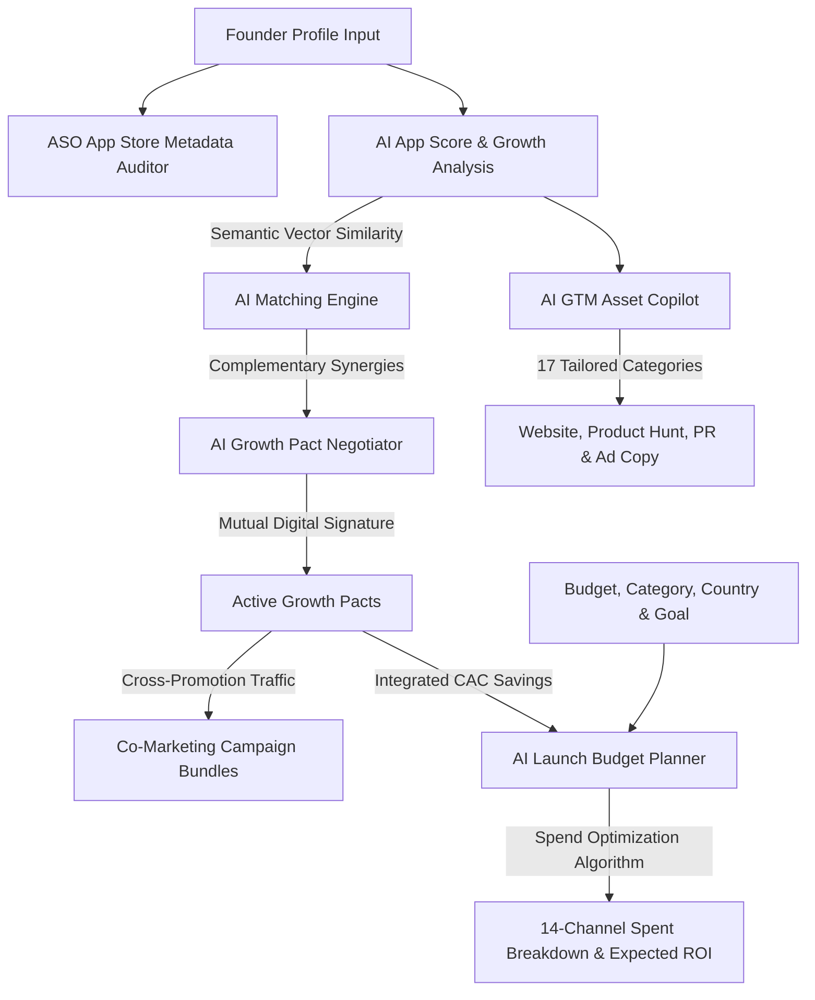

<div align="center">

<!-- Animated Header -->
<svg width="100%" viewBox="0 0 900 200" xmlns="http://www.w3.org/2000/svg">
  <defs>
    <linearGradient id="g" x1="0%" y1="0%" x2="100%" y2="100%">
      <stop offset="0%" style="stop-color:#0f2027"/>
      <stop offset="50%" style="stop-color:#203a43"/>
      <stop offset="100%" style="stop-color:#2c5364"/>
    </linearGradient>
  </defs>
  <rect width="900" height="200" fill="url(#g)" rx="0"/>
  <path d="M0,160 Q225,120 450,150 Q675,180 900,140 L900,200 L0,200 Z" fill="rgba(0,0,0,0.2)"/>
  <text x="450" y="95" font-family="Arial,sans-serif" font-size="62" font-weight="bold"
        fill="white" text-anchor="middle" letter-spacing="2">LaunchMesh</text>
  <text x="450" y="135" font-family="Arial,sans-serif" font-size="17"
        fill="rgba(255,255,255,0.85)" text-anchor="middle">
    AI-Powered GTM &amp; Co-Marketing Network
  </text>
</svg>

<br/>

<!-- Badges Row 1 -->


<br/><br/>

<!-- Badges Row 2 -->


<br/><br/>

> **LaunchMesh turns solo, low-budget mobile and web launches into collaborative, high-reach co-marketing campaigns — in minutes, not months.**
>
> By fusing an AI GTM Copilot, an ASO Auditor, and a partner vector-matching engine, LaunchMesh gives indie founders the audience reach of an agency at a fraction of the cost.

<br/>
</div>

## 📋 Questionnaire: Hackathon Submission Details

> [!TIP]
> **Our Hackathon Edge:**
> LaunchMesh does what no other tool in the market does: it combines target audience **Vector Matching** with **Digital Contract Negotiation** and **Pact-Integrated Spend Analytics** to completely bypass paid ad networks, giving founders organic, compound launch distribution for free.

# HackOnVibe — Project Questionnaire

**1. What does your application/service do?**

Most indie apps die not because they're bad — but because nobody sees them. Founders spend months building, then launch into silence. LaunchMesh fixes the distribution problem that no amount of good code can fix.
LaunchMesh is an AI-powered Go-To-Market coordinator that connects complementary founders to launch together instead of alone. The platform analyzes your product, finds startups with overlapping (but non-competing) audiences, and auto-generates legally-sound Growth Pacts — co-marketing agreements like newsletter swaps, shared banners, and push notification redirects — with one-click signing and live Slack sync.
It also ships with an ASO Metadata Auditor (real-time App Store scans for keyword gaps and character limit violations), an AI Launch Strategy Generator, a Budget Planner that shows exactly how much paid ad spend each co-marketing pact offsets, and an Audience Vector Matcher that maps audience demographics to surface the highest-synergy partners.
The result: more launch reach, lower CAC, zero ad spend required.

**2. Who is the target audience?**

Early-stage SaaS and mobile app founders who are tired of shouting into the void on launch day.
Specifically: indie hackers, solo developers, and small founding teams who have a working product but no marketing budget or distribution network. They're technically excellent but commercially stranded — launching on Product Hunt, getting 12 upvotes, and wondering what went wrong.
LaunchMesh is also built for student founders and accelerator cohorts where collective launch reach can be pooled across multiple teams simultaneously.

**3. Which countries are the expected buyers of this service?**

LaunchMesh targets startup-dense markets where organic co-marketing has the highest ROI delta against paid acquisition:
North America (US & Canada) — highest CAC environments globally; every dollar saved on ads is felt immediately
Europe (UK & Germany) — privacy-first culture makes audience-trade models more trusted than ad-network surveillance
India — world's fastest-growing developer population; bootstrapped founders actively seek zero-budget distribution strategies
Singapore & Australia — high startup density, strong cross-border collaboration culture
Country-level pricing is built in from day one to match local purchasing power.

**4. Who are your competitors?**


Every existing option forces founders to choose between visibility and strategy — LaunchMesh is the first platform that delivers both.
Launch listing sites (Product Hunt, BetaList, Peerlist, Uneed, Microlaunch) — great for a 24-hour traffic spike, zero for sustained growth. You get upvotes, not users. No partnerships, no co-marketing, no distribution network that compounds over time.
AI copywriting tools (ChatGPT, Copy.ai) — generate launch text but have zero distribution. Better-written posts that still nobody reads.
Enterprise co-marketing SaaS (Crossbeam, PartnerStack) — built for Series B companies with dedicated BD teams. Early-stage founders are priced out before they even see the dashboard.
Manual community networking (Twitter DMs, Indie Hackers) — high-effort, high-rejection, no semantic matching, no legal structure, no accountability.
LaunchMesh replaces all four categories in one workflow: AI-matched partners, auto-generated Growth Pacts, campaign coordination, and spend analytics — from zero to signed co-marketing deal in under 10 seconds. No listing fee. No BD team required. No cold DMs into the void.

**5. What is your advantage?**

Three moats competitors can't copy quickly:
(1) Audience Trade as Currency — instead of paying ad networks for attention, founders trade audiences with each other. LaunchMesh is the exchange layer that makes this trustless and scalable.
(2) Pact-Aware Spend Analytics — the AI Budget Planner doesn't just plan spend. It reads your active Growth Pacts and shows, in dollars, exactly how much paid acquisition each partnership replaces. Founders see savings in real time, not theory.
(3) 10-Second Deal Closing — from random cold match to signed co-marketing agreement with Slack channel sync takes about 10 seconds. The friction that kills every manual partnership negotiation is gone.
No other platform combines partner discovery + legal pact generation + spend offset analytics + campaign coordination in one workflow. The closest thing is hiring a BD person — LaunchMesh replaces that at $0 marginal cost per pact.

---

## 📺 Demo Walkthrough

<div align="center">

[](https://youtu.be/vqc5rid6MRQ)

*▶ Click to watch the full product walkthrough — AI Matching, Growth Pacts, ASO Auditing, and the Budget Planner in action.*

</div>

---

## ✦ What is LaunchMesh?

LaunchMesh is an **AI-powered Go-To-Market (GTM) and co-marketing coordinator** custom-built for indie hackers, solo developers, and early-stage SaaS/Mobile app founders. It directly solves the two most daunting roadblocks to shipping:

1. **The Cold Start Audience Problem** — If you don't have a marketing budget or social distribution, LaunchMesh matches you with complementary, non-competing products that share your target audience, enabling automated cross-promotions.
2. **The Asset Creation Bottleneck** — Writing copy, pitch decks, and brand guidelines takes weeks. Our GTM Copilot generates contextual, production-ready launch materials across 17 distinct categories in seconds.
3. **Budget Inefficiency** — Founders often waste early capital on misaligned paid ad channels. Our new AI Launch Budget Planner models optimization splits across 14 channels, factoring in active co-marketing pacts to save real dollars.

---

## 🗺️ Architectural Workflow

Here is how LaunchMesh orchestrates app profiles, Vector AI matching, automated contract drafting, and spend optimization:



---

## 🚀 Core Platform Features

### 🤝 AI Matching Engine
Finds growth partners by indexing product capabilities, target demographics, and user behavior patterns using vector embeddings. Every match features:
- **Compatibility Score** — direct product-to-product synergy alignment.
- **Trust Score** — validated reputation scores based on active partnership histories.
- **Audience Overlap Score** — verified demographic intersection signals.

### 📜 Growth Pacts
Structured co-marketing agreements (newsletter swaps, shared banner ads, push notification trade-offs) drafted and customized by LLMs. One-click approval, live Slack notification synchronization, and automated timeline scheduling.

### 📊 AI Launch Budget Planner
Our latest premium analytics addition. Input your budget, country, product category, and launch goal, and get:
- **14-Channel Split Breakdown:** Product Hunt, Reddit ads, X, LinkedIn, Google Ads, Meta Ads, Influencers, Newsletters, Discord, Slack, Telegram, Content Marketing, Giveaways, and Referral systems.
- **Growth Pact Integration:** If you have active Growth Pacts, the engine automatically shifts budget away from paid ad networks to free partner co-marketing channels, calculation exact money saved and free users acquired.
- **Comprehensive Summary Cards:** Live indicators for Total Budget, Est. New Users, Est. Revenue, Est. Profit, Break-even point (in installs/conversions), and overall AI confidence metrics.

### ✍️ GTM Copilot (17 Asset Categories)
Generates high-converting marketing materials tailored contextually to your application profile:

| Category | Assets Generated |
|---|---|
| 🎨 **Brand Kits** | Dynamic taglines, brand voice guidelines, color psychology rationales |
| 🌐 **Website Copy** | Engaging hero headers, feature matrices, pricing plans, CTA blocks |
| 🏆 **Product Hunt** | Compelling Maker pitches, taglines, first-comment copy, QA scripts |
| 📰 **Press Outreach** | Custom journalist pitches, formal press releases, media kit summaries |
| 📱 **Social Media** | X/Twitter threads, LinkedIn professional updates, video hooks/scripts |
| 💼 **Sales Kits** | Multi-step cold outreach sequences, one-pagers, demo scripts |
| 💰 **Investor Kits** | 30-second elevator pitches, traction models, pitch deck slide outlines |
| 📚 **Support Wikis** | Help center FAQs, user onboarding walkthroughs, documentation stubs |

### ASO Metadata Auditor
Scans your App Store configuration rules in real-time to alert you of:
- ❌ **Limit Breaks:** Title, subtitle, or description character length violations.
- ⚠️ **Competitor Infringements:** Checks if competitor brand names are present, preventing immediate App Store rejection.
- 📊 **Keyword Density:** Highlights missing search terms to maximize organic discoverability.

---

## 🛠️ Technology Stack

| Layer | Technologies Used |
|---|---|
| **Frontend** | React 19 + TypeScript + Vite |
| **State Management** | React Context (AppProfile, Analysis, Theme) |
| **Routing** | TanStack Router (Typesafe Navigation with Hash-scrolling) |
| **Querying** | TanStack React Query (Stale-while-revalidate Mock DB calls) |
| **Animations** | Framer Motion (Transitions & Micro-interactions) |
| **Styling** | TailwindCSS v4 + Glassmorphism system |
| **AI / LLMs** | Groq API — Llama-3-70b-instruct models |
| **CI / CD** | Cloudflare Pages (Automated builds, deploys & serverless API routes) |

---

## ⚡ Quick Start (Local Setup)

Get the project running on your local machine in under 3 minutes:

```bash
# 1. Clone the repository
git clone https://github.com/A-VISHAL/launchmesh.git
cd launchmesh

# 2. Install dependencies
npm install

# 3. Configure environment variables
cp .env.example .env
# Open .env and add your GROQ_API_KEY and VITE_SLACK_ACCESS_TOKEN

# 4. Spin up the development server
npm run dev
```

Open your browser to `http://localhost:5173/` and take control of your Go-To-Market campaign.

---

## 🌎 Who LaunchMesh Empowers

- 🧑‍💻 **Indie Hackers:** Launch with zero marketing budget and zero social media following by bootstrapping traffic through partner circles.
- 🚀 **SaaS Founders:** Save thousands of dollars in early paid ads by identifying high-synergy, direct cross-promotion targets.
- 📱 **Mobile App Developers:** Eliminate App Store submission anxiety with real-time metadata scanning and ASO auditing.
- 🤝 **Community Organizers:** Bundle multiple launch packages together for shared promotional events.

---

## 💎 Pricing Tiers

| Plan | Price | Features Included |
|---|---|---|
| **Founder** | $29/mo | 1 Active App Profile, Unlimited matching, full GTM generation |
| **Studio** | $79/mo | Up to 5 Active App Profiles, Team collaboration, advanced analytics |
| **Scale** | Custom | Multi-app launch pipelines, dedicated LLM context, custom API webhooks |

---

## 🏆 HackOnVibe July 2026

Built for **HackOnVibe July 2026** under the hackathon theme:
> **"Effective promotion of a newly launched mobile app."**

LaunchMesh addresses this theme directly by combining organic ASO discovery audits, vector matching with cross-promotion circles, launch collateral drafting, and multi-channel budget optimization to ensure mobile app launches gain immediate traction.

---

<div align="center">

**Developed with 💜 **

*LaunchMesh — Ship together, grow together.*


</div>
