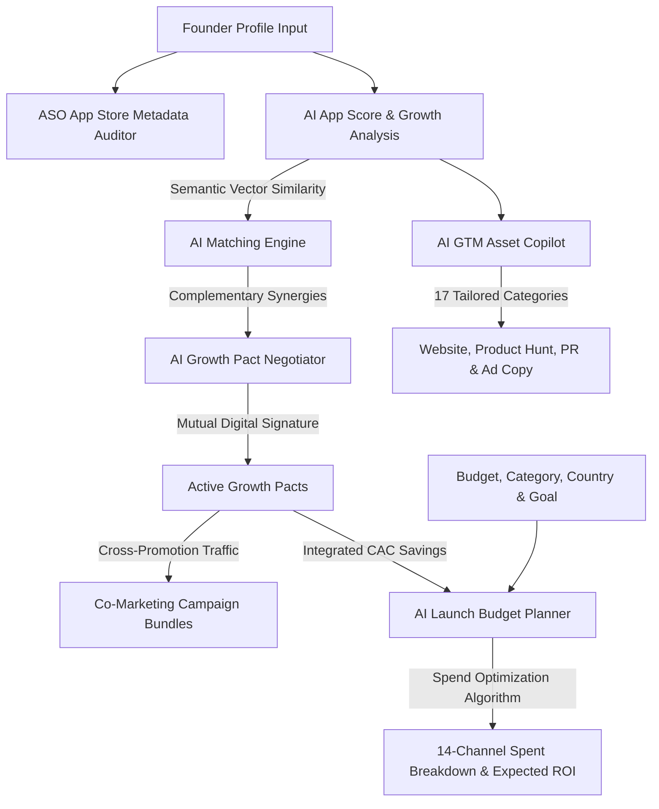

<div align="center">

<!-- Animated Header -->


<br/>

<!-- Badges Row 1 -->


<br/><br/>

<!-- Badges Row 2 -->


<br/><br/>

> **LaunchMesh turns solo, low-budget mobile and web launches into collaborative, high-reach co-marketing campaigns — in minutes, not months.**
> 
> By fusing an AI GTM Copilot, an ASO Auditor, and a partner vector-matching engine, LaunchMesh gives indie founders the audience reach of an agency at a fraction of the cost.

<br/>

</div>

## 📋 Questionnaire: Hackathon Submission Details

> [!TIP]
> **Our Hackathon Edge:**
> LaunchMesh does what no other tool in the market does: it combines target audience **Vector Matching** with **Digital Contract Negotiation** and **Pact-Integrated Spend Analytics** to completely bypass paid ad networks, giving founders organic, compound launch distribution for free.

### 1. What does your application/service do?
LaunchMesh is an end-to-end, AI-powered Go-To-Market (GTM) and co-marketing coordinator designed to solve the two biggest hurdles of promoting a new app: **distribution cold start** and **lack of marketing budget**.
- **Audience Vector Matching:** Instantly maps your app category and demographics to find high-synergy, non-competing growth partners.
- **Growth Pact Negotiation:** Auto-drafts digital co-marketing contracts (newsletter swaps, shared banners, push notification redirects) with one-click signing and live Slack sync.
- **ASO Metadata Auditor:** Scans App Store metadata in real-time to alert developers of character length limits, discoverability keywords, and competitor brand name violations.
- **AI Spent Optimizer:** Dynamically allocates budgets across 14 channels (Google, Meta, Product Hunt, Influencers, Slack, Reddit) and is the **first-ever tool** to integrate Growth Pacts to lower paid ad requirements, detailing exact marketing cash saved.

### 2. Who is the target audience?
- **Early-Stage SaaS & Mobile App Founders:** Builders who want to launch their product successfully without thousands of dollars in initial ad capital.
- **Indie Hackers & Solo Developers:** Developers who need marketing automation and collective launch reach instead of shouting into the void.

### 3. Which countries are the expected buyers of this service?
LaunchMesh targets startup hubs globally with specific country-level pricing models built in:
- **North America (United States & Canada):** High average customer acquisition cost (CAC) makes organic co-marketing partnerships highly lucrative.
- **Europe (United Kingdom & Germany):** High value placed on privacy-first, community-driven organic audience trades.
- **Asia (India):** Extremely high density of developers and young startups seeking cost-effective bootstrap strategies.

### 4. Who are your competitors?
- **Standard AI Copywriting Tools (ChatGPT, Copy.ai):** Can generate text, but provide **zero distribution channels** or partnership networks.
- **Co-Marketing SaaS (Crossbeam, PartnerStack):** Geared exclusively towards enterprise companies with mature sales and business development teams, pricing out early-stage founders.
- **Manual Networking (Twitter DMs, Indie Hackers):** Extremely slow, high rejection rate, and lacks semantic data matching or legal structure.

### 5. What is your advantage?
**No other competitor in the market has done this before:**
1. **Audience Trade over Ad Spend:** Instead of paying ad networks, LaunchMesh enables builders to trade audience attention, effectively using mutual redirects as a currency.
2. **Pact-Aware Spend Analytics:** Our AI Launch Budget Planner doesn't operate in a vacuum. It directly references your active co-marketing pacts to show exactly how much budget is saved by substituting paid channels with partner campaigns.
3. **Frictionless Business Deals:** Turning a random outreach message into an active campaign timeline, legal pact draft, and Slack sync takes 10 seconds.

---

## 📺 Demo Walkthrough

<div align="center">

[](https://www.youtube.com/watch?v=dQw4w9WgXcQ)

*▶ Click to watch the full product walkthrough — AI Matching, Growth Pacts, ASO Auditing, and the Budget Planner in action.*

</div>

---

## ✦ What is LaunchMesh?

LaunchMesh is an **AI-powered Go-To-Market (GTM) and co-marketing coordinator** custom-built for indie hackers, solo developers, and early-stage SaaS/Mobile app founders. It directly solves the two most daunting roadblocks to shipping:

1. **The Cold Start Audience Problem** — If you don't have a marketing budget or social distribution, LaunchMesh matches you with complementary, non-competing products that share your target audience, enabling automated cross-promotions.
2. **The Asset Creation Bottleneck** — Writing copy, pitch decks, and brand guidelines takes weeks. Our GTM Copilot generates contextual, production-ready launch materials across 17 distinct categories in seconds.
3. **Budget Inefficiency** — Founders often waste early capital on misaligned paid ad channels. Our new AI Launch Budget Planner models optimization splits across 14 channels, factoring in active co-marketing pacts to save real dollars.

---

## 🗺️ Architectural Workflow

Here is how LaunchMesh orchestrates app profiles, Vector AI matching, automated contract drafting, and spend optimization:



---

## 🚀 Core Platform Features

### 🤝 AI Matching Engine
Finds growth partners by indexing product capabilities, target demographics, and user behavior patterns using vector embeddings. Every match features:
- **Compatibility Score** — direct product-to-product synergy alignment.
- **Trust Score** — validated reputation scores based on active partnership histories.
- **Audience Overlap Score** — verified demographic intersection signals.

### 📜 Growth Pacts
Structured co-marketing agreements (newsletter swaps, shared banner ads, push notification trade-offs) drafted and customized by LLMs. One-click approval, live Slack notification synchronization, and automated timeline scheduling.

### 📊 AI Launch Budget Planner
Our latest premium analytics addition. Input your budget, country, product category, and launch goal, and get:
- **14-Channel Split Breakdown:** Product Hunt, Reddit ads, X, LinkedIn, Google Ads, Meta Ads, Influencers, Newsletters, Discord, Slack, Telegram, Content Marketing, Giveaways, and Referral systems.
- **Growth Pact Integration:** If you have active Growth Pacts, the engine automatically shifts budget away from paid ad networks to free partner co-marketing channels, calculation exact money saved and free users acquired.
- **Comprehensive Summary Cards:** Live indicators for Total Budget, Est. New Users, Est. Revenue, Est. Profit, Break-even point (in installs/conversions), and overall AI confidence metrics.

### ✍️ GTM Copilot (17 Asset Categories)
Generates high-converting marketing materials tailored contextually to your application profile:

| Category | Assets Generated |
|---|---|
| 🎨 **Brand Kits** | Dynamic taglines, brand voice guidelines, color psychology rationales |
| 🌐 **Website Copy** | Engaging hero headers, feature matrices, pricing plans, CTA blocks |
| 🏆 **Product Hunt** | Compelling Maker pitches, taglines, first-comment copy, QA scripts |
| 📰 **Press Outreach** | Custom journalist pitches, formal press releases, media kit summaries |
| 📱 **Social Media** | X/Twitter threads, LinkedIn professional updates, video hooks/scripts |
| 💼 **Sales Kits** | Multi-step cold outreach sequences, one-pagers, demo scripts |
| 💰 **Investor Kits** | 30-second elevator pitches, traction models, pitch deck slide outlines |
| 📚 **Support Wikis** | Help center FAQs, user onboarding walkthroughs, documentation stubs |

### ASO Metadata Auditor
Scans your App Store configuration rules in real-time to alert you of:
- ❌ **Limit Breaks:** Title, subtitle, or description character length violations.
- ⚠️ **Competitor Infringements:** Checks if competitor brand names are present, preventing immediate App Store rejection.
- 📊 **Keyword Density:** Highlights missing search terms to maximize organic discoverability.

---

## 🛠️ Technology Stack

| Layer | Technologies Used |
|---|---|
| **Frontend** | React 19 + TypeScript + Vite |
| **State Management** | React Context (AppProfile, Analysis, Theme) |
| **Routing** | TanStack Router (Typesafe Navigation with Hash-scrolling) |
| **Querying** | TanStack React Query (Stale-while-revalidate Mock DB calls) |
| **Animations** | Framer Motion (Transitions & Micro-interactions) |
| **Styling** | TailwindCSS v4 + Glassmorphism system |
| **AI / LLMs** | Groq API — Llama-3-70b-instruct models |
| **CI / CD** | Cloudflare Pages (Automated builds, deploys & serverless API routes) |

---

## ⚡ Quick Start (Local Setup)

Get the project running on your local machine in under 3 minutes:

```bash
# 1. Clone the repository
git clone https://github.com/A-VISHAL/launchmesh.git
cd launchmesh

# 2. Install dependencies
npm install

# 3. Configure environment variables
cp .env.example .env
# Open .env and add your GROQ_API_KEY and VITE_SLACK_ACCESS_TOKEN

# 4. Spin up the development server
npm run dev
```

Open your browser to `http://localhost:5173/` and take control of your Go-To-Market campaign.

---

## 🌎 Who LaunchMesh Empowers

- 🧑‍💻 **Indie Hackers:** Launch with zero marketing budget and zero social media following by bootstrapping traffic through partner circles.
- 🚀 **SaaS Founders:** Save thousands of dollars in early paid ads by identifying high-synergy, direct cross-promotion targets.
- 📱 **Mobile App Developers:** Eliminate App Store submission anxiety with real-time metadata scanning and ASO auditing.
- 🤝 **Community Organizers:** Bundle multiple launch packages together for shared promotional events.

---

## 💎 Pricing Tiers

| Plan | Price | Features Included |
|---|---|---|
| **Founder** | $29/mo | 1 Active App Profile, Unlimited matching, full GTM generation |
| **Studio** | $79/mo | Up to 5 Active App Profiles, Team collaboration, advanced analytics |
| **Scale** | Custom | Multi-app launch pipelines, dedicated LLM context, custom API webhooks |

---

## 🏆 HackOnVibe July 2026

Built for **HackOnVibe July 2026** under the hackathon theme:
> **"Effective promotion of a newly launched mobile app."**

LaunchMesh addresses this theme directly by combining organic ASO discovery audits, vector matching with cross-promotion circles, launch collateral drafting, and multi-channel budget optimization to ensure mobile app launches gain immediate traction.

---

<div align="center">

**Developed with 💜 by [A-VISHAL](https://github.com/A-VISHAL)**

*LaunchMesh — Ship together, grow together.*


</div>
